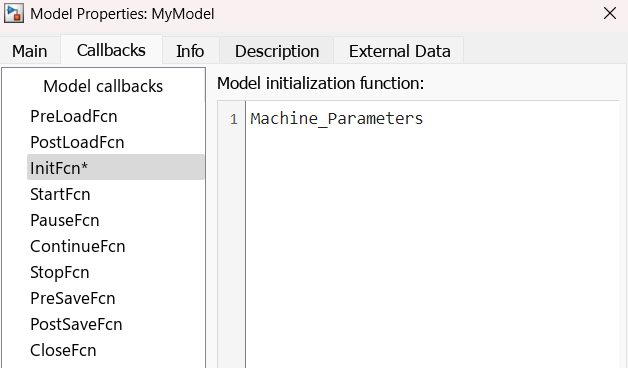

# DC Motor Speed Control Simulation 🚀

This repository contains a Simulink-based simulation project to model and control the speed of a DC motor using classical control techniques such as the **PID controller**. This project is useful for students and enthusiasts interested in control systems, modeling, and real-time simulation with MATLAB & Simulink.

---

## 🧠 Project Objectives

- Model a DC motor using its physical parameters.
- Design and tune a PID controller to maintain desired motor speed.
- Analyze performance (overshoot, settling time, rise time).
- Visualize system response with scopes and plots.
- Demonstrate closed-loop speed regulation under step inputs.

---

## 🛠️ Files Included

| File/Folder                 | Description                                                  |
|----------------------------|--------------------------------------------------------------|
| `MyModel.slx`              | Main Simulink model file                                     |
| `MyModel.slxc`             | Simulink cache file (auto-generated, ignored going forward)  |
| `Machine_Parameters.m`     | MATLAB script defining motor parameters                      |
| `DCMotorSpeedControlSimulation.prj` | Simulink Project file                            |
| `resources/project/`       | Additional model assets or references                        |

**Note:** You can ignore `.slxc` — it's an auto-generated Simulink cache file not needed for version control or manual editing.

---

## 🧪 Technologies Used

- **MATLAB** (for scripting and parameter definition)
- **Simulink** (for block diagram-based modeling)
- **Control System Toolbox**
- **PID Controller Tuning**

---

## ⚙️ How to Run

1. Clone the repository:
   ```bash
   git clone https://github.com/DhanushGit03/DCMotorSpeedControlSimulation.git
2. Open the .prj file in MATLAB by navigating to the cloned folder using the Open Folder option.
<p align="center">
  
</p>
3. Now right-click on the Simulink model and select Model Properties.
4. Navigate to the Call Backs tab, then paste the saved file contents from Machine_Parameters.m into the appropriate callback section (such as InitFcn).
5. Click Apply and then OK.
6. Click the Run button in Simulink to start the simulation.
